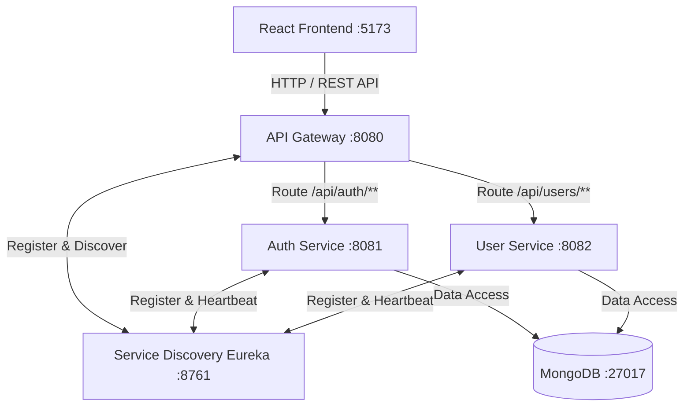

# SmartBus Travel - Modern Smart Bus Booking & Transit Platform

Welcome to **SmartBus Travel**, a cloud-native, microservices-based smart bus transit and booking platform built with Spring Boot, React, MongoDB, and modern DevOps practices. This repository is built as an educational capstone project emphasizing clean architecture, role-based security, modularity, and high maintainability.

---

## Table of Contents
- [1. What is SmartBus Travel?](#1-what-is-smartbus-travel)
- [2. Main Purpose](#2-main-purpose)
- [3. Technology Stack](#3-technology-stack)
- [4. Microservices Architecture](#4-microservices-architecture)
- [5. Frontend Architecture](#5-frontend-architecture)
- [6. Backend Architecture](#6-backend-architecture)
- [7. Database Design](#7-database-design)
- [8. Authentication & Authorization](#8-authentication--authorization)
- [9. Login Flow](#9-login-flow)
- [10. Signup Flow](#10-signup-flow)
- [11. Roles and Permissions (User, Driver, Admin)](#11-roles-and-permissions)
- [12. Project Folder Structure](#12-project-folder-structure)
- [13. How to Run Locally (Terminal Development)](#13-how-to-run-locally)
- [14. Environment Variables](#14-environment-variables)
- [15. Docker Workflow](#15-docker-workflow)
- [16. Git Workflow](#16-git-workflow)
- [17. Current Development Status (Phase 1)](#17-current-development-status)
- [18. Future Modules & Roadmap](#18-future-modules--roadmap)

---

## 1. What is SmartBus Travel?
**SmartBus Travel** is an end-to-end smart transportation management platform designed to automate intercity and commuter bus travel. It coordinates passengers, drivers, and fleet administrators across a distributed web ecosystem.

## 2. Main Purpose
- Enable passengers to discover routes, reserve seats, and track buses.
- Empower drivers with trip route details, schedule management, and real-time status updates.
- Provide transit operators and administrators with central fleet supervision, route scheduling, user management, and operational analytics.
- Serve as a clear, real-world learning reference for building scalable microservices with Spring Cloud, Spring Boot, React, and MongoDB.

---

## 3. Technology Stack

### Frontend
- **Framework**: React 18+ (SPA with Vite tooling)
- **Styling**: Vanilla CSS (Tailored Design System, Dark Theme with Crimson Red Travel accents & Glassmorphism)
- **Routing**: React Router DOM v6
- **State & HTTP**: Context API / Native Fetch API with Bearer Token interceptor
- **Icons**: Lucide React

### Backend (Microservices)
- **Framework**: Spring Boot 3.3.4 / Java 21+
- **Microservices Orchestration**: Spring Cloud Netflix Eureka (Service Discovery) & Spring Cloud Gateway (API Gateway)
- **Security**: Spring Security 6 & JSON Web Tokens (jjwt 0.12.6)
- **Password Hashing**: BCrypt (strength 10)
- **Persistence**: Spring Data MongoDB

### Database & Infrastructure
- **Database**: MongoDB (port 27017, database: `smartbus_db`)
- **Containerization**: Docker & Docker Compose
- **Build Tool**: Apache Maven (Backend) & npm (Frontend)

---

## 4. Microservices Architecture

SmartBus Travel adopts an API Gateway + Service Registry pattern:



---

## 5. Frontend Architecture
The React application is modularized for clarity and maintainability:
- **`src/components/`**: Reusable UI blocks (Navbar, ProtectedRoute).
- **`src/pages/`**: Main page views (SplashScreen, Login, Register, UserDashboard, DriverDashboard, AdminDashboard).
- **`src/context/`**: Global state management (`AuthContext`) handling token persistence, decoded user roles, and login/logout helpers.
- **`src/services/`**: API abstraction layer (`authService.js`, `api.js`) that injects Bearer headers and handles standard error responses.

---

## 6. Backend Architecture
Each backend microservice follows standard clean layered architecture:
1. **Controller Layer (`@RestController`)**: Exposes REST endpoints, validates incoming DTOs, and returns HTTP `ResponseEntity`.
2. **Service Layer (`@Service`)**: Encapsulates business logic, orchestrates password hashing, and issues JWT tokens.
3. **Repository Layer (`@Repository`)**: Interacts with MongoDB collections via Spring Data `MongoRepository`.
4. **DTO Layer (Data Transfer Objects)**: Strictly defines request payloads and sanitizes response payloads (never leaking password hashes).
5. **Security / Config Layer**: Defines CORS rules, stateless SessionManagement, and JWT Filter chains.

---

## 7. Database Design
MongoDB is utilized as the primary document store. In Phase 1, the `users` collection in `smartbus_db` stores credentials and profiles:

```json
{
  "_id": "6705ab89d34e912a",
  "fullName": "Sarah Passenger",
  "email": "sarah@example.com",
  "phone": "+1987654321",
  "password": "$2a$10$e8wF5q...",
  "role": "ROLE_USER",
  "accountStatus": "ACTIVE",
  "createdAt": "2026-10-08T10:00:00Z",
  "updatedAt": "2026-10-08T10:00:00Z"
}
```

---

## 8. Authentication & Authorization
- **Stateless Authentication**: Sessions are not kept in server memory. Every authorized request carries a cryptographically signed JWT token in the `Authorization: Bearer <TOKEN>` header.
- **Hashing**: Passwords are encrypted using BCrypt before database persistence.
- **Role Authority**: Roles use standard Spring Security names (`ROLE_USER`, `ROLE_DRIVER`, `ROLE_ADMIN`).

---

## 9. Login Flow
```
User submits Email + Password
          ↓
React sends POST /api/auth/login to API Gateway (:8080)
          ↓
API Gateway forwards to Auth Service (:8081)
          ↓
Auth Service checks email in MongoDB
          ↓
BCrypt matches raw password against stored hash
          ↓
Auth Service retrieves user role (ROLE_USER / ROLE_DRIVER / ROLE_ADMIN)
          ↓
Auth Service signs JWT containing userId, email, and role
          ↓
HTTP 200 with JWT + role payload sent back to React
          ↓
React AuthContext stores token in localStorage and state
          ↓
React Router dynamically navigates to role-specific dashboard:
    ROLE_USER   -> /user/dashboard
    ROLE_DRIVER -> /driver/dashboard
    ROLE_ADMIN  -> /admin/dashboard
```

---

## 10. Signup Flow
```
Public visitor fills Full Name, Email, Phone, Password, Confirm Password
          ↓
React validates input format & password match
          ↓
React sends POST /api/auth/register to API Gateway (:8080)
          ↓
Auth Service verifies email is unique in MongoDB
          ↓
Auth Service hashes password using BCrypt
          ↓
Auth Service HARDCODES role to ROLE_USER (preventing privilege escalation)
          ↓
User document saved in MongoDB
          ↓
HTTP 201 Success response returned (password omitted)
          ↓
React displays success toast and redirects user to /login
```

---

## 11. Roles and Permissions
| Role | How Account is Created | Access Level | Target Dashboard |
| :--- | :--- | :--- | :--- |
| **`ROLE_USER`** | Public self-signup | Book tickets, view reservations, manage profile | `/user/dashboard` |
| **`ROLE_DRIVER`**| Created only by Admin | View assigned trips, inspect passenger lists, update trip status | `/driver/dashboard` |
| **`ROLE_ADMIN`** | Seeded on initial bootstrap | Manage fleet, schedule routes, register drivers, view analytics | `/admin/dashboard` |

---

## 12. Project Folder Structure
```
SmartBus-Travel/
│
├── frontend/                     # React Single Page Application (Vite)
│   ├── public/
│   ├── src/
│   │   ├── components/           # Navbar, ProtectedRoute
│   │   ├── context/              # AuthContext.jsx
│   │   ├── pages/                # SplashScreen, Login, Register, Dashboards
│   │   ├── services/             # authService.js, api.js
│   │   ├── App.jsx
│   │   ├── index.css             # SmartBus Red Travel Theme
│   │   └── main.jsx
│   ├── package.json
│   └── README.md
│
├── backend/                      # Spring Boot Microservices
│   ├── service-discovery/        # Eureka Registry (:8761)
│   ├── api-gateway/              # Spring Cloud Gateway (:8080)
│   ├── auth-service/             # Authentication & JWT Provider (:8081)
│   └── user-service/             # User Profile Service (:8082)
│
├── docs/                         # Detailed Concept & Architecture Guides
│   ├── 01-project-architecture.md
│   ├── 02-login-flow.md
│   ├── 03-signup-flow.md
│   ├── 04-jwt-explanation.md
│   ├── 05-microservices-explanation.md
│   └── 06-development-workflow.md
│
├── .gitignore
├── docker-compose.yml
└── README.md
```

---

## 13. How to Run Locally

### Prerequisites
1. **Java JDK 21+**
2. **Apache Maven 3.8+**
3. **Node.js (v18+) & npm**
4. **MongoDB** running locally on `mongodb://localhost:27017`

### Execution Order
Open 5 terminal windows and start in order:

#### Terminal 1: Service Discovery (Eureka)
```bash
cd backend/service-discovery
mvn spring-boot:run
```
*Port:* `8761` | *Dashboard:* `http://localhost:8761`

#### Terminal 2: API Gateway
```bash
cd backend/api-gateway
mvn spring-boot:run
```
*Port:* `8080`

#### Terminal 3: Auth Service
```bash
cd backend/auth-service
mvn spring-boot:run
```
*Port:* `8081`

#### Terminal 4: User Service
```bash
cd backend/user-service
mvn spring-boot:run
```
*Port:* `8082`

#### Terminal 5: Frontend (React)
```bash
cd frontend
npm install
npm run dev
```
*Port:* `5173` | *URL:* `http://localhost:5173`

---

## 14. Current Development Status
- [x] Phase 1 Authentication Implementation Completed
  - [x] Service Discovery (Eureka Server)
  - [x] API Gateway with routing & CORS
  - [x] Auth Service with BCrypt & JWT issuing
  - [x] User Service with profile endpoints
  - [x] React Frontend with Splash, Login, Register, and 3 Role Dashboards
  - [x] Automatic Admin seeding on startup (`admin@smartbus.com` / `Admin@123`)
